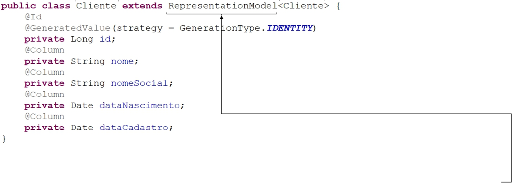
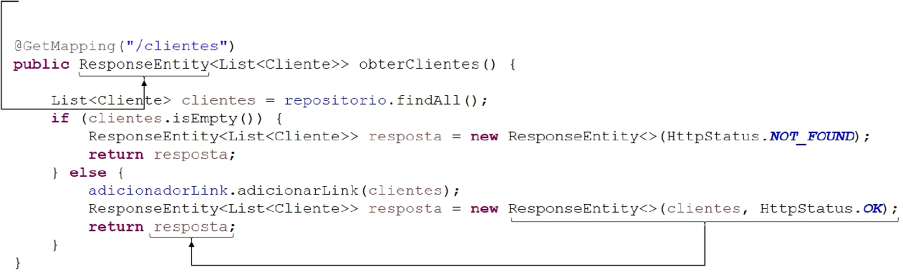
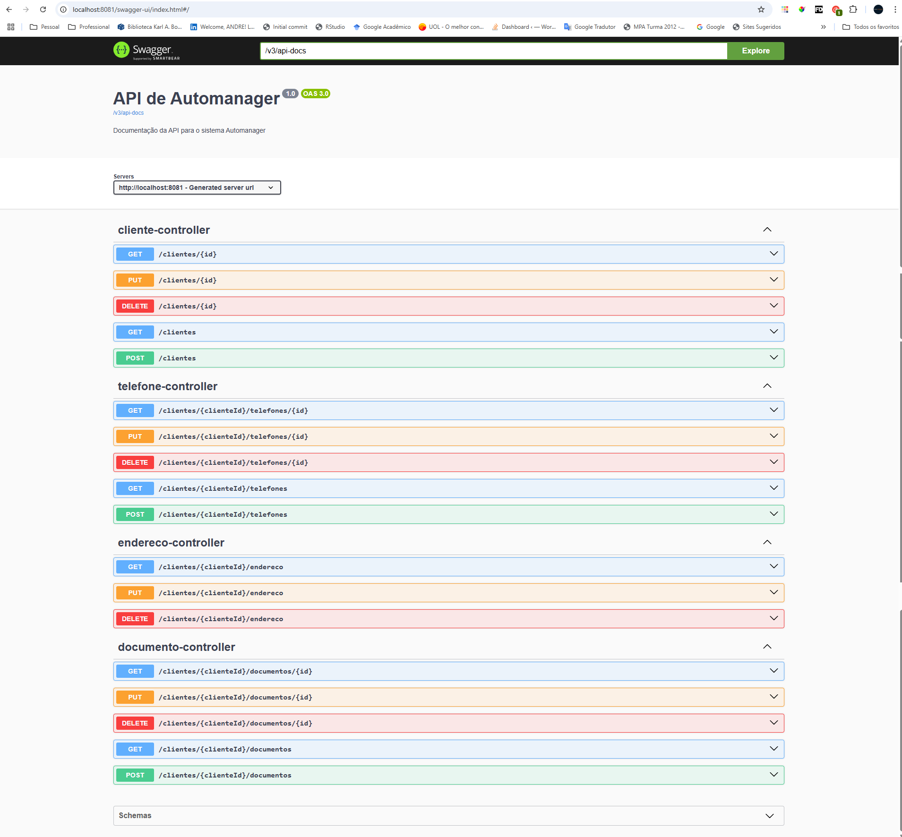

## Atividade II

Empresa criada: AutoBots


Fundador, Dev e Engenheiro de Software: André Salerno

## Objetivo

Implementar os 4 níveis de maturidade, conhecidos como RMM (Richardson Maturity Model). São eles:

- Nível 0 - Uso do protocolo HTTP
- Nível 1 - Uso de URIs para identificar recursos
- Nível 2 - Uso de HTTP Verbos corretos
- Nível 3 - HATEOAS

## Padrão esperado






## Padrão reproduzido no código

```java
# Cliente.java

public class Cliente extends RepresentationModel<Cliente>{
	@Id
	@GeneratedValue(strategy = GenerationType.IDENTITY)
	private Long id;
	@Column
	private String nome;
	@Column
	private String nomeSocial;
	@Column
	@JsonFormat(pattern = "yyyy-MM-dd")
	private LocalDate dataNascimento;
	@Column
	@JsonFormat(pattern = "yyyy-MM-dd")
	private LocalDate dataCadastro;
	@OneToMany(orphanRemoval = true, cascade = CascadeType.ALL)
	private List<Documento> documentos = new ArrayList<>();
	@OneToOne(cascade = CascadeType.ALL, orphanRemoval = true)
	private Endereco endereco;
	@OneToMany(orphanRemoval = true, cascade = CascadeType.ALL)
	@JsonManagedReference
	private List<Telefone> telefones = new ArrayList<>();
	public Long getId() {
		return id;
	}
}

```

```java
// Listar todos os clientes
    @GetMapping
    public ResponseEntity<List<EntityModel<Cliente>>> listarClientes() {
        List<Cliente> clientes = clienteService.listarClientes();
        if (clientes.isEmpty()) {
            return ResponseEntity.status(HttpStatus.NO_CONTENT).build();
        }

        // Adicionando links a cada cliente
        adicionadorLinkCliente.adicionarLink(clientes);

        // Criando o EntityModel com links para cada cliente
        List<EntityModel<Cliente>> clientesModel = clientes.stream()
                .map(cliente -> EntityModel.of(cliente,
                        WebMvcLinkBuilder.linkTo(WebMvcLinkBuilder.methodOn(ClienteController.class).obterCliente(cliente.getId())).withSelfRel(),
                        WebMvcLinkBuilder.linkTo(WebMvcLinkBuilder.methodOn(ClienteController.class).listarClientes()).withRel("clientes")))
                .collect(Collectors.toList());

        return ResponseEntity.ok(clientesModel);
    }

```

## Tecnologias utilizadas

- VSCode
- Eclipse
- GitHub
- Swagger

## Etapas para rodar o projeto

1. Clonando o projeto
```powershell
git clone https://github.com/andresalerno/DES-WEBIII-atvii.git
```

2. Criação de um container
```powershell
docker run -d --name atvii -p 3310:3306 -e MYSQL_ROOT_PASSWORD=salerno mysql:latest
```

3. Estabelecendo uma comunicação com o container: WORKBENCH

4. Criação de um banco de dados com o nome: `atvii`

5. Rodar o arquivo `AutomanagerApplication.java`


## Endpoints - Swagger

Acesse o seguinte link: [http://localhost:8081/swagger-ui/index.html#/]




## Insomnia

### Cliente

<div align="left">

|                                                                    Tipo | Rota                     | Ação                               |
| ----------------------------------------------------------------------: | :----------------------- | :--------------------------------- |
|    []() | `http://localhost:8081/clientes`                | Listagem de clientes             |
|    []() | `http://localhost:8081/clientes/{id}`            | Listar cliente by id     |
|   []() | `http://localhost:8081/clientes`          | Cadastro de cliente              |
|    []() | `http://localhost:8081/clientes/{id}`          | Alteração dos dados do cliente     |
| []() | `http://localhost:8081/clientes/{id}`     | Exclusão de cliente             |


### Endereço

<div align="left">

|                                                                    Tipo | Rota                     | Ação                               |
| ----------------------------------------------------------------------: | :----------------------- | :--------------------------------- |            
|    []() | `http://localhost:8081/clientes/{id}/endereco`            | Listar endereço by id     |
|   []() | `http://localhost:8081/clientes/{id}/endereco`          | Cadastro de endereço              |
|    []() | `http://localhost:8081/clientes/{id}/endereco`          | Alteração dos dados do endereço     |
| []() | `http://localhost:8081/clientes/{id}/endereco`     | Exclusão de endereço             |


### Modelos para JSON

```json
# post e put para cliente
{
	"nome": "Andre Salerno",
	"nomeSocial": "Santo Andreeeeeeee",
	"dataNascimento": "2002-06-15",
	"dataCadastro": "2025-04-04"
}
```

```json
# post e put para endereço
{
    "estado": "SP",
    "cidade": "São José dos Campos",
    "bairro": "Urbanova",
	"rua": "Alcides Cunha",
	"numero": "140",
	"codigoPostal": "12242000",
	"informacoesAdicionais": "Informações adicionais"
}
```

Demais endpoints podem ser testados no Swagger. Acesse o seguinte link: [http://localhost:8081/swagger-ui/index.html#/]


## Estrutura do projeto

```bash

└───automanager_atvii
    │   .classpath
    │   .factorypath
    │   .gitignore
    │   .project
    │   mvnw
    │   mvnw.cmd
    │   pom.xml
    │
    ├───.mvn
    │   └───wrapper
    │           maven-wrapper.jar
    │           maven-wrapper.properties
    │
    ├───.settings
    │       org.eclipse.core.resources.prefs
    │       org.eclipse.jdt.apt.core.prefs
    │       org.eclipse.jdt.core.prefs
    │       org.eclipse.m2e.core.prefs
    │       org.springframework.ide.eclipse.prefs
    │
    ├───bin
    │   │   .gitignore
    │   │   .project
    │   │   mvnw
    │   │   mvnw.cmd
    │   │   pom.xml
    │   │
    │   ├───.mvn
    │   │   └───wrapper
    │   │           maven-wrapper.jar
    │   │           maven-wrapper.properties
    │   │
    │   ├───.settings
    │   │       org.eclipse.core.resources.prefs
    │   │
    │   ├───src
    │   │   ├───main
    │   │   │   ├───java
    │   │   │   │   └───com
    │   │   │   │       └───autobots
    │   │   │   │           └───automanager
    │   │   │   │               │   AutomanagerApplication$Runner.class
    │   │   │   │               │   AutomanagerApplication.class
    │   │   │   │               │
    │   │   │   │               ├───controles
    │   │   │   │               │       ClienteControle.class
    │   │   │   │               │
    │   │   │   │               ├───entidades
    │   │   │   │               │       Cliente.class
    │   │   │   │               │       Documento.class
    │   │   │   │               │       Endereco.class
    │   │   │   │               │       Telefone.class
    │   │   │   │               │
    │   │   │   │               ├───modelos
    │   │   │   │               │       AdicionadorLink.class
    │   │   │   │               │       AdicionadorLinkCliente.class
    │   │   │   │               │       ClienteAtualizador.class
    │   │   │   │               │       ClienteSelecionador.class
    │   │   │   │               │       DocumentoAtualizador.class
    │   │   │   │               │       EnderecoAtualizador.class
    │   │   │   │               │       StringVerificadorNulo.class
    │   │   │   │               │       TelefoneAtualizador.class
    │   │   │   │               │
    │   │   │   │               └───repositorios
    │   │   │   │                       ClienteRepositorio.class
    │   │   │   │
    │   │   │   └───resources
    │   │   │           application.properties
    │   │   │
    │   │   └───test
    │   │       └───java
    │   │           └───com
    │   │               └───autobots
    │   │                   └───automanager
    │   │                           AutomanagerApplicationTests.class
    │   │
    │   └───target
    │       └───classes
    │           └───META-INF
    │                   MANIFEST.MF
    │
    ├───src
    │   ├───main
    │   │   ├───java
    │   │   │   └───com
    │   │   │       └───autobots
    │   │   │           └───automanager
    │   │   │               │   AutomanagerApplication.java
    │   │   │               │
    │   │   │               ├───config
    │   │   │               │       SwaggerConfig.java
    │   │   │               │       WebConfig.java
    │   │   │               │
    │   │   │               ├───controles
    │   │   │               │       ClienteController.java
    │   │   │               │       DocumentoController.java
    │   │   │               │       EnderecoController.java
    │   │   │               │       TelefoneController.java
    │   │   │               │
    │   │   │               ├───entidades
    │   │   │               │       Cliente.java
    │   │   │               │       Documento.java
    │   │   │               │       Endereco.java
    │   │   │               │       Telefone.java
    │   │   │               │
    │   │   │               ├───modelos
    │   │   │               │       AdicionadorLink.java
    │   │   │               │       AdicionadorLinkCliente.java
    │   │   │               │       ClienteAtualizador.java
    │   │   │               │       ClienteSelecionador.java
    │   │   │               │       DocumentoAtualizador.java
    │   │   │               │       DocumentoSelecionador.java
    │   │   │               │       EnderecoAtualizador.java
    │   │   │               │       EnderecoSelecionador.java
    │   │   │               │       StringVerificadorNulo.java
    │   │   │               │       TelefoneAtualizador.java
    │   │   │               │       TelefoneSelecionador.java
    │   │   │               │
    │   │   │               ├───repositorios
    │   │   │               │       ClienteRepositorio.java
    │   │   │               │       DocumentoRepositorio.java
    │   │   │               │       EnderecoRepositorio.java
    │   │   │               │       TelefoneRepositorio.java
    │   │   │               │
    │   │   │               └───servicos
    │   │   │                       ClienteService.java
    │   │   │                       DocumentoService.java
    │   │   │                       EnderecoService.java
    │   │   │                       TelefoneService.java
    │   │   │
    │   │   └───resources
    │   │           application.properties
    │   │
    │   └───test
    │       └───java
    │           └───com
    │               └───autobots
    │                   └───automanager
    │                           AutomanagerApplicationTests.java
    │
    └───target
        ├───classes
        │   │   application.properties
        │   │
        │   ├───com
        │   │   └───autobots
        │   │       └───automanager
        │   │           │   AutomanagerApplication$Runner.class
        │   │           │   AutomanagerApplication.class
        │   │           │
        │   │           ├───config
        │   │           │       SwaggerConfig.class
        │   │           │       WebConfig.class
        │   │           │
        │   │           ├───controles
        │   │           │       ClienteController.class
        │   │           │       DocumentoController.class
        │   │           │       EnderecoController.class
        │   │           │       TelefoneController.class
        │   │           │
        │   │           ├───entidades
        │   │           │       Cliente.class
        │   │           │       Documento.class
        │   │           │       Endereco.class
        │   │           │       Telefone.class
        │   │           │
        │   │           ├───modelos
        │   │           │       AdicionadorLink.class
        │   │           │       AdicionadorLinkCliente.class
        │   │           │       ClienteAtualizador.class
        │   │           │       ClienteSelecionador.class
        │   │           │       DocumentoAtualizador.class
        │   │           │       DocumentoSelecionador.class
        │   │           │       EnderecoAtualizador.class
        │   │           │       EnderecoSelecionador.class
        │   │           │       StringVerificadorNulo.class
        │   │           │       TelefoneAtualizador.class
        │   │           │       TelefoneSelecionador.class
        │   │           │
        │   │           ├───repositorios
        │   │           │       ClienteRepositorio.class
        │   │           │       DocumentoRepositorio.class
        │   │           │       EnderecoRepositorio.class
        │   │           │       TelefoneRepositorio.class
        │   │           │
        │   │           └───servicos
        │   │                   ClienteService.class
        │   │                   DocumentoService.class
        │   │                   EnderecoService.class
        │   │                   TelefoneService.class
        │   │
        │   └───META-INF
        │       │   MANIFEST.MF
        │       │
        │       └───maven
        │           └───com.autobots
        │               └───automanager
        │                       pom.properties
        │                       pom.xml
        │
        ├───generated-sources
        │   └───annotations
        ├───generated-test-sources
        │   └───test-annotations
        ├───maven-status
        │   └───maven-compiler-plugin
        │       └───compile
        │           └───default-compile
        └───test-classes
            └───com
                └───autobots
                    └───automanager
                            AutomanagerApplicationTests.class

```